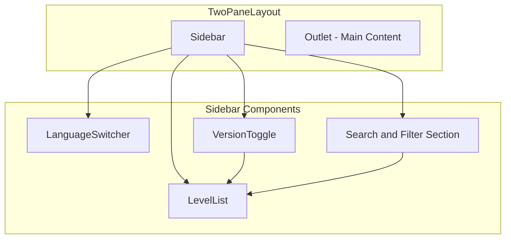
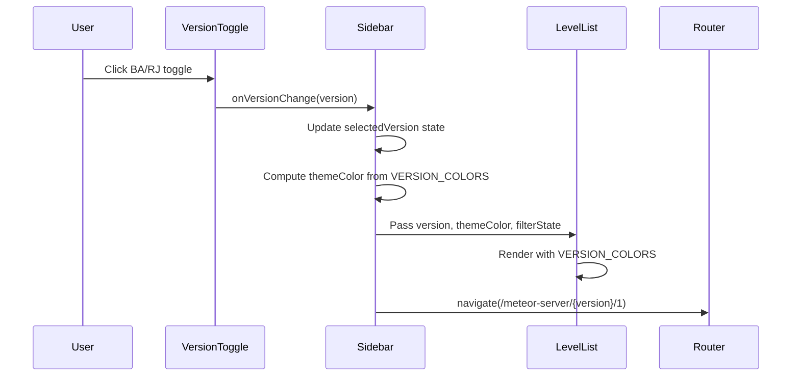

# Design Document: react-layout-redesign

## Overview

**Purpose**: React フロントエンドのレイアウトを刷新し、視認性と操作性を向上させる。AppBar を廃止してコンテンツ領域を最大化し、BA/RJ バージョン切替を直感的なUIで提供する。

**Users**: ゲームプレイヤーがファイナライズフォルダ（デッキ）を確認・比較する際に使用する。

**Impact**: 既存の TwoPaneLayout と Sidebar コンポーネントを修正し、新規コンポーネント（VersionToggle, LevelList）を追加する。既存のルーティング・データフローは維持される。

### Goals

- AppBar を廃止し、画面高さ 100vh を左右ペインで完全活用
- 「BA/RJ FolderView」というstartIconつきラベルを左ペイントップに
- 言語切替は
- BA/RJ バージョン切替を トグル式 にする。角丸の領域内に、角丸ボタンの２つを横に並べる。ボタン押下時、イージングでページ全体背景色をバージョンのカラーに切り替える。
- 検索条件領域は現状ボーダー区切りだが、カード化する
- カード要素は全てフラットにして、アウトライン表示にする
- レベルリストを単一列配置に変更し、情報階層を明確化
- VERSION_COLORS を活用した一貫したカラーテーマ適用

### Non-Goals

- DLL 側の実装変更
- Electron 側の実装変更
- ルーティング構造の変更（`/meteor-server/:version/:level` は維持）
- 検索・フィルタロジックの変更（表示レイアウトのみ対象）

---

## Requirements Traceability

| Requirement | Summary | Components | Interfaces | Flows |
|-------------|---------|------------|------------|-------|
| 1.1 | AppBar 除去 | TwoPaneLayout | - | - |
| 1.2 | ナビ機能を左ペイン統合 | Sidebar, LanguageSwitcher | SidebarProps | - |
| 1.3 | 100vh 高さ使用 | TwoPaneLayout | - | - |
| 2.1 | バージョンセクション分離 | VersionToggle, LevelList | VersionToggleProps | - |
| 2.2 | テーマカラー適用 | Sidebar, VersionToggle, LevelList | - | VersionChange |
| 2.3 | レベル単一列配置 | LevelList | LevelListProps | - |
| 2.4 | ヒット件数表示 | LevelList | LevelListProps | - |
| 3.1 | タブ/トグル切替 | VersionToggle | VersionToggleProps | VersionChange |
| 3.2 | 左ペイン配色変更 | Sidebar | - | VersionChange |
| 3.3 | 選択バージョン強調 | VersionToggle | - | - |
| 4.1 | 検索欄固定表示 | Sidebar | - | - |
| 4.2 | 属性アイコン横並び | Sidebar | - | - |
| 4.3 | 選択状態フィードバック | Sidebar | - | - |
| 4.4 | クリアボタン表示 | Sidebar | - | - |
| 5.1 | 左ペイン幅制約 | Sidebar | - | - |
| 5.2 | メイン領域流動的 | TwoPaneLayout | - | - |
| 5.3 | 内部要素折り返し | Sidebar | - | - |
| 6.1 | BA カラー適用 | VersionToggle, LevelList, Sidebar | - | - |
| 6.2 | RJ カラー適用 | VersionToggle, LevelList, Sidebar | - | - |
| 6.3 | コントラスト明確化 | VersionToggle | - | - |

---

## Architecture

### Existing Architecture Analysis

**現行構成**:
- `TwoPaneLayout`（41行）: AppBar（40px高）+ 左右2ペイン構成
- `Sidebar`（300行）: 検索・フィルタ・レベルボタンを一体化
- レベルボタン: BA/RJ を2列で並列表示（12行 × 2列）

**変更対象**:
- `TwoPaneLayout.tsx`: AppBar 削除、LanguageSwitcher を Sidebar へ移動
- `Sidebar.tsx`: 内部構造をリファクタリング、VersionToggle と LevelList を分離

**維持するパターン**:
- React Router によるルーティング（`/meteor-server/:version/:level`）
- useState による状態管理
- MUI コンポーネントの使用
- VERSION_COLORS による配色（`rgb(49, 74, 90)` / `rgb(181, 33, 57)`）

### Architecture Pattern & Boundary Map



**Architecture Integration**:
- **Selected pattern**: ハイブリッドアプローチ（既存修正 + 部分的な新規作成）
- **Domain boundaries**: Sidebar が左ペイン全体を管理、子コンポーネントは表示責任のみ
- **Existing patterns preserved**: MUI コンポーネント使用、useState 状態管理、バレルエクスポート
- **New components rationale**:
  - `VersionToggle`: BA/RJ 切替UIを独立させ、Sidebar の責任を軽減
  - `LevelList`: レベルボタン群を分離し、表示ロジックをカプセル化
- **Steering compliance**: packages/ui/ 内への変更限定、PascalCase 命名規則

### Technology Stack & Alignment

| Layer | Choice / Version | Role in Feature | Notes |
|-------|------------------|-----------------|-------|
| Frontend | React 19 | コンポーネントレンダリング | 既存維持 |
| UI Framework | MUI v6 | ToggleButtonGroup, Box, Typography, Button | 既存維持 |
| Routing | React Router v7 | URL パラメータ取得、ナビゲーション | useParams, useNavigate |
| State | React useState | フィルタ状態、バージョン選択 | 既存パターン |
| i18n | react-i18next | 多言語対応 | 既存維持 |

---

## System Flows

### VersionChange Flow

バージョン切替時のデータフローを示す。



**Key Decisions**:
- バージョン変更時は Lv1 にリセット（初期状態として自然）
- テーマカラーは VERSION_COLORS を直接参照（ハードコード回避）
- URL とローカル状態を同期（useParams + useNavigate）

---

## Components and Interfaces

### Summary

| Component | Domain/Layer | Intent | Req Coverage | Key Dependencies | Contracts |
|-----------|--------------|--------|--------------|------------------|-----------|
| TwoPaneLayout | layouts | AppBar なしの2ペイン構成 | 1.1, 1.3, 5.2 | Sidebar (P0), Outlet (P0) | - |
| Sidebar | components | 左ペイン全体の管理 | 1.2, 2.2, 3.2, 4.1-4.4, 5.1, 5.3, 6.1, 6.2 | VersionToggle (P1), LevelList (P1), LanguageSwitcher (P1) | State |
| VersionToggle | components | BA/RJ 切替UI | 2.1, 3.1, 3.3, 6.3 | MUI ToggleButtonGroup (P0) | Props |
| LevelList | components | レベルボタン群の表示 | 2.3, 2.4 | React Router Link (P0) | Props |
| LanguageSwitcher | components | 言語切替（既存移動） | 1.2 | react-i18next (P0) | - |

---

### Layouts

#### TwoPaneLayout

| Field | Detail |
|-------|--------|
| Intent | AppBar を廃止した2ペインレイアウトを提供 |
| Requirements | 1.1, 1.3, 5.2 |

**Responsibilities & Constraints**
- 画面高さ 100vh を左右ペインで完全使用
- AppBar コンポーネントを完全に除去
- メインコンテンツ領域は残りスペースを流動的に使用（`flex: 1`）

**Dependencies**
- Inbound: routes.tsx — レイアウトコンポーネントとして使用 (P0)
- Outbound: Sidebar — 左ペイン描画 (P0)
- Outbound: Outlet — メインコンテンツ描画 (P0)

**Contracts**: State [ ]

##### Interface

```typescript
interface TwoPaneLayoutProps {
  finalizationData: FinalizationData;
  gaList: GalaxyAdvance[];
}
```

**Implementation Notes**
- Integration: AppBar 削除により約 40px の縦スペースを確保
- Validation: flexbox `height: 100vh` で画面全体を使用
- Risks: AppBar 内の LanguageSwitcher を Sidebar に移動する必要あり

---

### Components

#### Sidebar

| Field | Detail |
|-------|--------|
| Intent | 左ペイン全体を管理し、検索・フィルタ・バージョン切替・レベル選択を統合 |
| Requirements | 1.2, 2.2, 3.2, 4.1-4.4, 5.1, 5.3, 6.1, 6.2 |

**Responsibilities & Constraints**
- 幅を 280px-360px の範囲で固定（現行 310px を維持可能）
- 検索入力欄を上部に固定表示
- LanguageSwitcher を上部に統合
- フィルタ状態（selectedType, selectedCard）を管理
- 選択バージョンに応じたテーマカラーを全体に適用
- クリアボタンをフィルタアクティブ時に表示

**Dependencies**
- Inbound: TwoPaneLayout — 左ペインとして配置 (P0)
- Outbound: VersionToggle — バージョン切替UI (P1)
- Outbound: LevelList — レベルボタン群 (P1)
- Outbound: LanguageSwitcher — 言語切替 (P1)
- External: useParams — URL パラメータ取得 (P0)
- External: useNavigate — ナビゲーション (P0)

**Contracts**: State [x]

##### State Management

```typescript
interface SidebarProps {
  finalizationData: FinalizationData;
}

// Internal state (既存 + 拡張)
interface SidebarInternalState {
  selectedType: string | null;        // 既存: 属性フィルタ
  selectedCard: Card | null;          // 既存: カード検索
  selectedVersion: Version;           // 新規: バージョン選択
}

// Derived values
const isFilterActive = selectedType !== null || selectedCard !== null;
const themeColor = VERSION_COLORS[selectedVersion];
```

- **Persistence**: なし（ページ遷移でリセット）
- **Concurrency**: 単一ユーザー操作のみ
- **Initial State**: URL パラメータから selectedVersion を初期化

**Implementation Notes**
- Integration: VersionToggle と LevelList を子コンポーネントとして配置
- Validation: selectedVersion は 'BA' | 'RJ' に限定（型安全）
- Risks: 検索・フィルタ状態と子コンポーネント間のデータフロー確認が必要

---

#### VersionToggle

| Field | Detail |
|-------|--------|
| Intent | BA/RJ バージョン切替の ToggleButton UI を提供 |
| Requirements | 2.1, 3.1, 3.3, 6.3 |

**Responsibilities & Constraints**
- MUI ToggleButtonGroup を使用（exclusive モード）
- 選択中バージョンを視覚的に強調（VERSION_COLORS 適用）
- 非選択バージョンは低コントラストで表示

**Dependencies**
- Inbound: Sidebar — props 経由でバージョン状態を受信 (P0)
- External: MUI ToggleButtonGroup (P0)

**Contracts**: Props [x]

##### Props Interface

```typescript
interface VersionToggleProps {
  selectedVersion: Version;
  onVersionChange: (version: Version) => void;
}
```

- **Preconditions**: selectedVersion は 'BA' または 'RJ'
- **Postconditions**: onVersionChange は新しいバージョン値を呼び出し元に通知

**Implementation Notes**
- Integration: Sidebar の selectedVersion 状態と連携
- Validation: ToggleButtonGroup の exclusive モードで単一選択を保証
- Risks: VERSION_COLORS との整合性を維持（定数を直接 import）

---

#### LevelList

| Field | Detail |
|-------|--------|
| Intent | 選択バージョンのレベルボタン群を単一列で表示 |
| Requirements | 2.3, 2.4 |

**Responsibilities & Constraints**
- Lv1-12 を縦に単一列配置
- フィルタ適用時はヒット件数を各ボタンに表示
- ヒット件数 0 のボタンは disabled スタイル
- React Router Link でナビゲーション
- 選択バージョンのテーマカラーを適用

**Dependencies**
- Inbound: Sidebar — props 経由でバージョン・フィルタ情報を受信 (P0)
- External: React Router Link (P0)
- External: VERSION_COLORS (P0)

**Contracts**: Props [x]

##### Props Interface

```typescript
interface LevelListProps {
  version: Version;
  finalizationData: FinalizationData;
  selectedType: string | null;
  selectedCard: Card | null;
  currentLevel: number | null;
  themeColor: string;
}
```

- **Preconditions**: version は 'BA' または 'RJ'、finalizationData は有効なデータ
- **Postconditions**: 各レベルボタンは `/meteor-server/{version}/{level}` にリンク

##### Internal Logic

```typescript
// getHitCount ロジックを Sidebar から移植
function getHitCount(
  finalizationData: FinalizationData,
  version: Version,
  level: number,
  selectedType: string | null,
  selectedCard: Card | null
): number;
```

**Implementation Notes**
- Integration: 既存 getHitCount ロジックを移植または props 経由で受け取る
- Validation: level は 1-12 の範囲
- Risks: 現行2列→単一列でスクロール量増加（384px で許容範囲内）

---

#### LanguageSwitcher

| Field | Detail |
|-------|--------|
| Intent | 日英言語切替UI（既存コンポーネント、配置のみ変更） |
| Requirements | 1.2 |

**Responsibilities & Constraints**
- 既存機能を維持
- TwoPaneLayout（AppBar 内）から Sidebar 上部に移動

**Dependencies**
- Inbound: Sidebar — 配置場所として使用 (P0)
- External: react-i18next (P0)

**Implementation Notes**
- Integration: 既存コンポーネントをそのまま import
- Validation: 変更なし
- Risks: 配置変更に伴うスタイル調整が必要な場合あり

---

## Data Models

### Domain Model

**変更なし** - 既存の型定義を維持

```typescript
// types/card.ts（既存）
type Version = 'BA' | 'RJ';
type Level = 1 | 2 | 3 | 4 | 5 | 6 | 7 | 8 | 9 | 10 | 11 | 12;

const VERSION_COLORS: Record<Version, string> = {
  BA: 'rgb(49, 74, 90)',
  RJ: 'rgb(181, 33, 57)',
};

interface FinalizationData {
  BA: FinalizationSet;
  RJ: FinalizationSet;
}

interface FinalizationSet {
  LV1: Card[];
  LV2: Card[];
  // ... LV12 まで
}
```

---

## Error Handling

### Error Strategy

UIレイアウト変更のため、エラーハンドリングの変更は最小限。

### Error Categories and Responses

**User Errors**:
- 無効なバージョン/レベル URL → 既存の FolderDetail エラー表示を維持

**System Errors**:
- finalizationData 未読み込み → 既存の loading/error 表示を維持

---

## Testing Strategy

### Unit Tests

テストフレームワーク（Vitest）で以下を確認:

- VersionToggle: BA/RJ 切替時のコールバック呼び出し確認
- LevelList: ヒット件数表示、disabled 状態の正確性
- Sidebar: フィルタクリア動作、状態初期化

### Integration Tests

- TwoPaneLayout: AppBar 非表示、100vh 高さ確認
- Sidebar → LevelList: バージョン切替時のカラー適用
- Sidebar → Router: バージョン切替時の URL 変更

### E2E/UI Tests（Playwright）

- 全レベルボタンのクリックナビゲーション
- 検索・属性フィルタの動作確認
- 言語切替の動作確認
- レスポンシブ表示（ウィンドウ幅変更時）

---

## Performance & Scalability

**パフォーマンス目標**:
- 初期表示 1 秒以内（NFR-2）
- レイアウト変更によるレンダリング劣化なし

**対策**:
- 仮想スクロール不使用（12項目のみで不要）
- useMemo でフィルタ計算を最適化（既存パターン維持）
- 子コンポーネント分離による再レンダリング範囲の限定

---

## Supporting References

詳細な調査ログ・設計決定の経緯は `research.md` を参照:
- MUI Tabs vs ToggleButton の比較検討
- Sidebar 分割方式の評価
- バージョン選択状態管理の設計根拠
